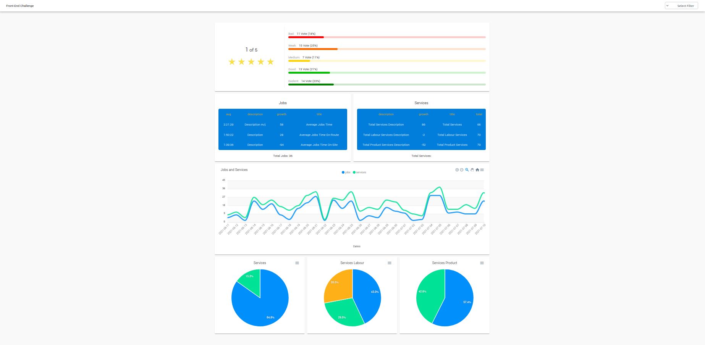

# Apx-Chart Sample (Angular)

## Demo



## Demo Link
https://apx-chart-sample.netlify.app

## Usage

- Install packages

    ```bash
    npm install
    ```

- Run json-server

    ```bash
    json-server --watch db.json
    ```

- Start the project

    ```bash
    ng serve
    or
    npm start
    ```
